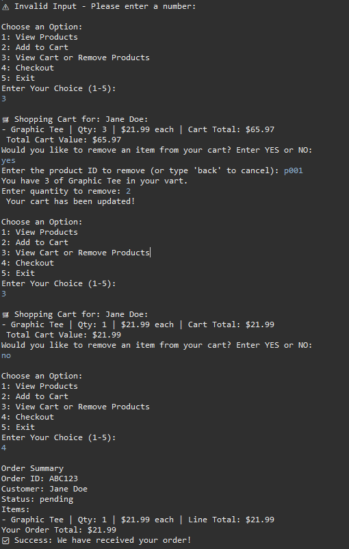
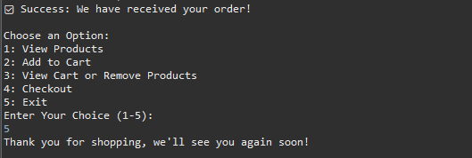

# *Simple Java E-commerce System*
This project is a console-based e-commerce system built with Java, showcasing **Object-Oriented Programming (OOP)** principles. Customers can view product details, manage a shopping cart, and check out with a unique order ID. Profiles store customer info and purchase history, while orders are tracked with a "pending" status.

## Features

- 🛒 Shopping cart: add/remove products
- 📦 Checkout with unique order IDs
- 👤 Customer profiles with name, ID, and purchase history
- 📂 Modular package structure (Customer, Product, Order, Main)
- 🎛️ Menu-driven console interface (switch statement)
- 🔄 Robust error handling with exceptions and loops
- ⚙️ Encapsulation via getters/setters for clean data flow
- 💡 Demonstrates practical OOP design patterns

## Tech Stack

**Language:**

**Tools**

## Screenshots

## License

*Copyright 2025 Dominique Wilson*

Licensed under the Apache License, Version 2.0 (the "License");
you may not use this file except in compliance with the License.
You may obtain a copy of the License at:

	http://www.apache.org/licenses/LICENSE-2.0

Unless required by applicable law or agreed to in writing, software
distributed under the License is distributed on an "AS IS" BASIS,
WITHOUT WARRANTIES OR CONDITIONS OF ANY KIND, either express or implied.
See the License for the specific language governing permissions and
limitations under the License.

    
## Contact:
 **Connect with DevDominique**
 
 
